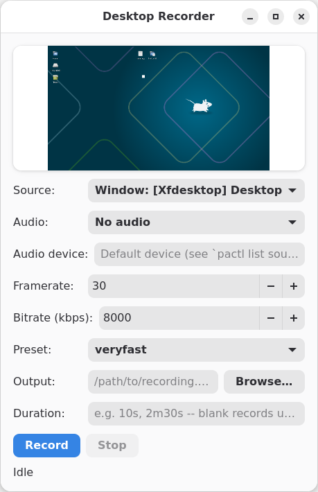

# desktoprecorder

[](https://github.com/sw8566eq/desktoprecorder/actions/workflows/ci.yml)

A screen recorder for Linux, written in Rust on top of GStreamer. CLI and GTK4/libadwaita GUI, sharing the same recording engine.



## Features

- Full-screen, per-monitor, or per-window capture (`--monitor`/`--window`, or pick from a dropdown in the GUI)
- Optional audio: microphone, system audio (via the default sink's PulseAudio monitor), or both mixed together
- Matroska (`.mkv`) or MP4 output, clean EOS-based shutdown on Ctrl+C/SIGTERM (both CLI and GUI) so files are never left truncated; closing the GUI window mid-recording is refused rather than losing the file
- GUI: live preview of the selected source (before and during recording), optional duration (blank = record until Stop, capped at 24h), and framerate/bitrate/preset/audio-device controls matching the CLI
- Global `Ctrl+Alt+R` hotkey to start/stop recording from the GUI, even when the window isn't focused
- GUI settings (source, audio mode/device, framerate, bitrate, preset) persist across launches, saved to `~/.config/desktoprecorder/config.toml` on each Record click
- Wayland support via `xdg-desktop-portal` + PipeWire (`desktoprecorder record` only, not the GUI yet) — the compositor's own picker dialog takes the place of `--monitor`/`--window`, since portals don't expose enumeration ahead of time

## Requirements

Debian/Ubuntu (adjust package manager elsewhere):

```bash
sudo apt install build-essential pkg-config \
  libgstreamer1.0-dev libgstreamer-plugins-base1.0-dev \
  gstreamer1.0-plugins-good gstreamer1.0-plugins-bad gstreamer1.0-plugins-ugly \
  gstreamer1.0-libav gstreamer1.0-tools gstreamer1.0-pipewire \
  libgtk-4-dev libadwaita-1-dev \
  pulseaudio-utils
```

`gstreamer1.0-pipewire` (the `pipewiresrc` element) is only needed for `record`'s Wayland path; X11 capture (and the GUI, which is X11-only for now) doesn't use it.

The GUI is X11-only — it detects a Wayland session and fails with a clear message pointing at `record` instead, rather than attempting anything that would silently produce a black recording.

## Build

```bash
cargo build --release
```

## Usage

```bash
# Record the full screen for 10 seconds
desktoprecorder record --output demo.mkv --duration 10s

# Record a specific monitor with mic audio, until Ctrl+C
desktoprecorder record --output demo.mkv --duration 1h --monitor 0 --audio mic

# List available monitors and windows (for --monitor/--window)
desktoprecorder list-sources

# Launch the GUI
desktoprecorder gui
```

Every subcommand takes `--help`; `desktoprecorder record --help` has the full flag list (framerate, bitrate, speed preset, container, audio device override).

## License

None specified yet.
